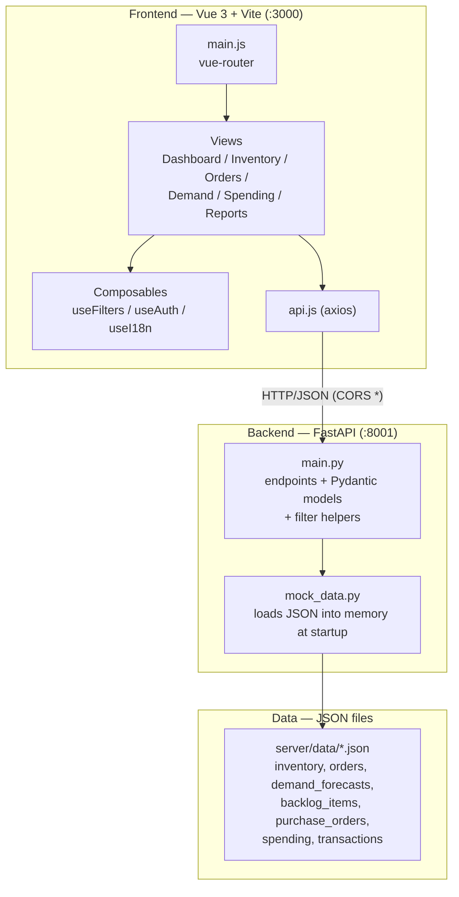
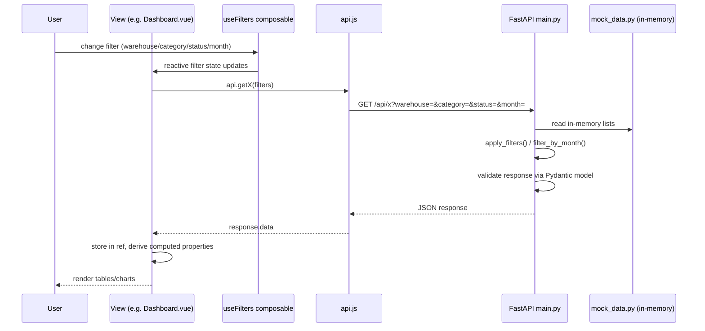

# Architecture Overview

## System Diagram

## Data-Flow Diagram

## Frontend Notes
- `client/src/main.js` — app entry, mounts `App.vue`, defines `vue-router` routes to each view.
- `client/src/views/*.vue` — one per nav tab; owns data loading (`ref` + `onMounted`) and page-level `computed` derivations.
- `client/src/components/*.vue` — reusable UI: `FilterBar`, detail modals (`InventoryDetailModal`, `ProductDetailModal`, `BacklogDetailModal`, `CostDetailModal`), `ProfileMenu`, `TasksModal`, `LanguageSwitcher`.
- `client/src/composables/` — shared reactive state: `useFilters` (the 4 global filters), `useAuth`, `useI18n`.
- `client/src/api.js` — single axios client, one function per endpoint; base URL hardcoded to `http://localhost:8001/api`.
- Some `api.js` functions (`getTasks`, `createTask`, `deleteTask`, `toggleTask`, purchase-order endpoints) have no matching route in `server/main.py` — verify before relying on them.

## Backend Notes
- `server/main.py` — all routes, Pydantic models, and the shared `apply_filters` / `filter_by_month` helpers live in this one file (no routers/services split yet).
- `server/mock_data.py` — loads `server/data/*.json` once at import time into module-level lists; this is the only "data layer" (no database).
- `server/generate_data.py` — standalone script to (re)generate the JSON fixtures in `server/data/`.
- Filtering (`warehouse`, `category`, `status`, `month`) is done in Python over in-memory lists per-request; nothing is cached or indexed.
- CORS is wide open (`allow_origins=["*"]`) — dev-only setting.

## Key Files
| Concern | Path |
|---|---|
| Frontend entry / routing | `client/src/main.js` |
| Frontend API client | `client/src/api.js` |
| Global filter state | `client/src/composables/useFilters.js` |
| Backend entry / all endpoints | `server/main.py` |
| Backend data loader | `server/mock_data.py` |
| Fixture generator | `server/generate_data.py` |
| Raw data | `server/data/*.json` |
